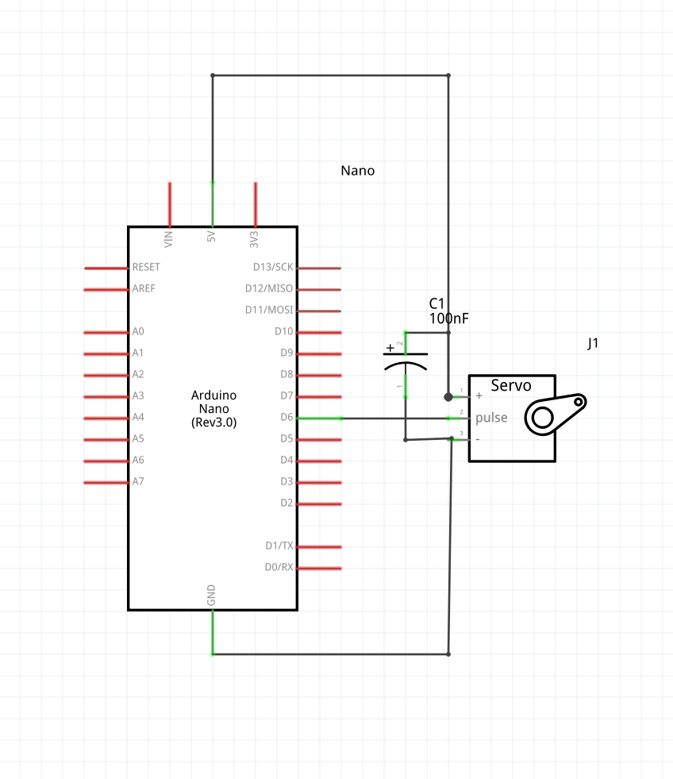

# Materia Flag

Materia flag is a physical notification system for your desktop.

You can build one yourself with an Arduino, an old box of Oban, a knife, and some hot glue (plus cables and a servo motor).

The condensator is 100 micro pharad (not nano as in picture).
